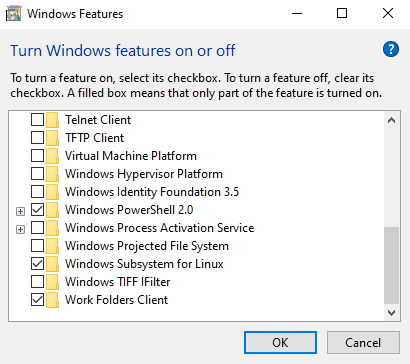
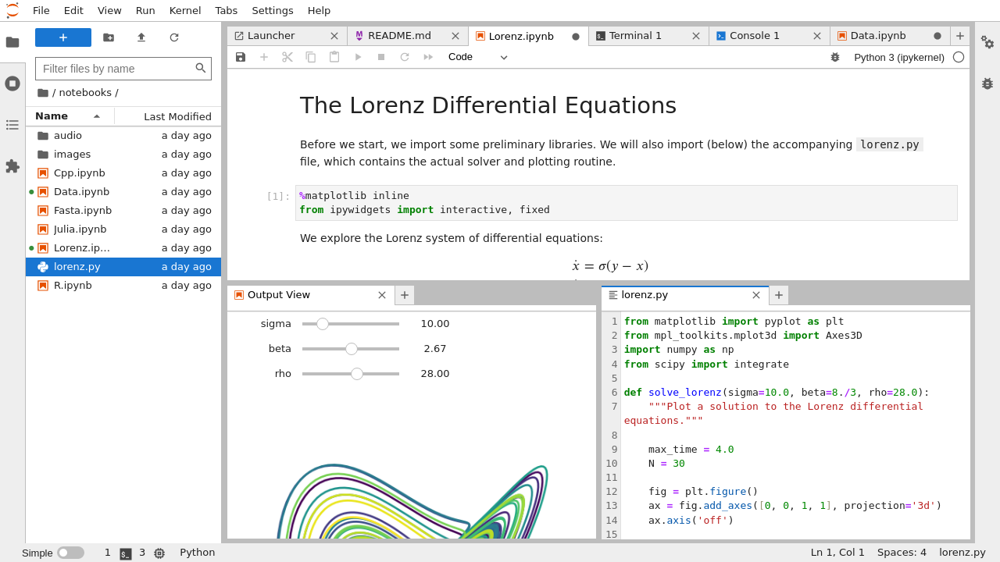

# Data Lab
> [!TIP]
> This is a project shows how to build an AI/ML system in a WSL environment. Of course, the same can be applied in a general Linux environment.

# Workspace
## Install Debian on WSL
Open Settings > Apps > Programs and Features > Turn Windows features on or off dialog and select the *Windows Subsystem for Linux* to enable WSL on your system. You may reboot your system.



After you have enabled WSL, you can install linux distribution via Microsoft Store. We will use the latest version of Debian linux for the hands-on lab. Open Microsoft Store app and search *Debian* (Debian 12, Bookworm), and install.

To verify your install, open windows terminal or command terminal and run `wsl -l -v` command to list WSL distributions. For more details about WSL command, please refer to [Basic commands for WSL](https://learn.microsoft.com/en-us/windows/wsl/basic-commands).

## JupyterLab
In this example, we will use [Jupyter notebook](./labs/jupyter/jupyter.md) as primary interactive interface for AI, ML, Analytics examples. Before starting the hands-on lab, run JupyterLab by selecting your preferred installation option (Docker, Python Virtual Environment).

### Install using Package Manager
One of the installation options is to use packages managers. We're going to install Python, and utilities via Debian Apt (Advanced Package Tool), and install JupyterLab using python package installer.
```
sudo apt update
sudo apt install python3 python3-venv python3-pip-whl python-is-python3
python --version
```

> [!TIP]
> If you are not able to install *python-is-python3* package, configure alias to the python version 3 binary file.
```
edit ~/.bashrc
alias python="/usr/bin/python3"
```

The next step is activating your python virtual environment for jupyter workspace. Under the cloned *data-lab* repositiry on your local system, run the command to activate your python virtual environment.
```
python -m venv .venv
source ./.venv/bin/activate
```

Next, install Jupyter and dependencies using PIP (Package Installer for Python) in your virtual environment. The packages in the *requirements.txt* file are tested on python 3.11.2, therefore you may see error if you are running on different python version (.venv).
```
pip install -r requirements.txt
```

Launch a JupyterLab and open a web browser to access (if you want to change the port number, add `--port 8080` parameter):
```
jupyter-lab --no-browser
```

## Run in Container
You can simplify JupyterLab environment setup using container runtime such as Docker, Podman, or Kubernetes. Install [Docker](https://docs.docker.com/engine/install/) or [Podman](https://podman.io/docs/installation) to your system and run the command.

```
podman run --rm -p 8888:8888 -v "${PWD}":/home/jovyan/work \
    quay.io/jupyter/base-notebook:lab-4.0.7 start-notebook.py --NotebookApp.token='your-token'
```
The following are the notable parts of the command:
- `-p 8888:8888`: Maps port 8888 on your Debian host to port 8888 in the container.
- `-v "${PWD}":/home/jovyan/work`: Mounts your current directory to the container, allowing you to save notebooks locally.
- `--NotebookApp.token='your-token'`: Sets a custom password/token for access.
- `--rm`: Automatically removes the container when it is stopped.

After running the command, check the terminal output for a URL containing `127.0.0.1:8888`, then, open your web browser and navigate to that URL.



# Labs
- [Analytics](labs/analytics.md)
- [ML (Machine Learning)](labs/machinelearning.md)

# Clean up
Stop and terminate the running Juypter and other processes wth `ctrl+c` keys and following the instructions that appear. Then, if you run your JupyterLab in python virtual environment, run `deactivate` command to exit. In case of container runtime (Docker or Podman), use docker/podman command to stop, or remove container processes and volumes if necessary.

```
(.venv) deactivate
```

# Additional Resources
- [Terraform: Data on Amazon EKS](https://github.com/Young-ook/terraform-aws-eks/tree/main/examples/data-ai)
