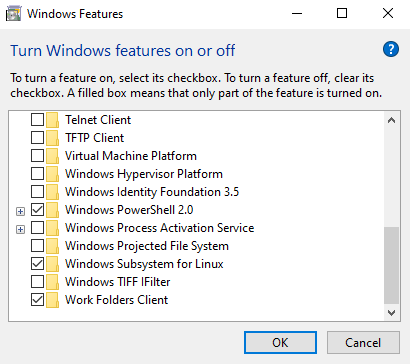

# Data Lab
> [!TIP]
> This is a project shows how to build an AI/ML system in a WSL environment. Of course, the same can be applied in a general Linux environment.

# Workspace
## Install Debian on WSL
Open Settings > Apps > Programs and Features > Turn Windows features on or off dialog and select the *Windows Subsystem for Linux* to enable WSL on your system. You may reboot your system.



After you have enabled WSL, you can install linux distribution via Microsoft Store. We will use the latest version of Debian linux for the hands-on lab. Open Microsoft Store app and search *Debian* (Debian 12, Bookworm), and install.

To verify your install, open windows terminal or command terminal and run `wsl -l -v` command to list WSL distributions. For more details about WSL command, please refer to [Basic commands for WSL](https://learn.microsoft.com/en-us/windows/wsl/basic-commands).

## JupyterLab
### Install Python
In this example, we will use jupyter notebook as primary interactive interface for AI, ML, Analytics examples. The runtime requiremet is Python 3.11.2 on Debian 12 linux. The first step is installing python and python virtual environment module:
```
sudo apt update
sudo apt install python3 python3-venv python3-pip-whl python-is-python3
```

Verify your python installation status using `python -V` or `python --version`. If you are not able to install *python-is-python3* package, configure alias to the python version 3 binary file.

```
edit ~/.bashrc
alias python="/usr/bin/python3"
```

### Activate your virtual environment and install Jupyter
The next step is activating your python virtual environment for jupyter workspace. Under the cloned *data-lab-on-wsl* repositiry on your local environment, run source command to activate a new virtual environment:
```
python -m venv .venv
source ./.venv/bin/activate
```

After you are in your virtual environment, install jupyter package and dependencies using PIP(Package Installer for Python). The packages described in the *requirements.txt* file are tested on python 3.11.2, therefore you may see error if you are running on different python version (.venv).
```
 pip install -r requirements.txt
```

### Launch Jupyter Lab
Launch a jupyter lab and open a web browser to access (if you want to change the port number, add `--port 8080` parameter):
```
jupyter-lab --no-browser
```

# Labs
- [Analytics Lab](labs/analytics-lab.md)
- [ML (Machine Learning) Lab](labs/ml-lab.md)

# Clean up
You can stop and terminate the running Juypter and other processes by simply pressing `ctrl+c` and following the instructions that appear. Then, type `deactivate` to exit the virtual environment:
```
(.venv) deactivate
```

# Additional Resources
- [Terraform: Amazon SageMaker](https://github.com/Young-ook/terraform-aws-sagemaker/tree/main/examples/blueprint)
- [Terraform: Data on Amazon EKS](https://github.com/Young-ook/terraform-aws-eks/tree/main/examples/data-ai)
