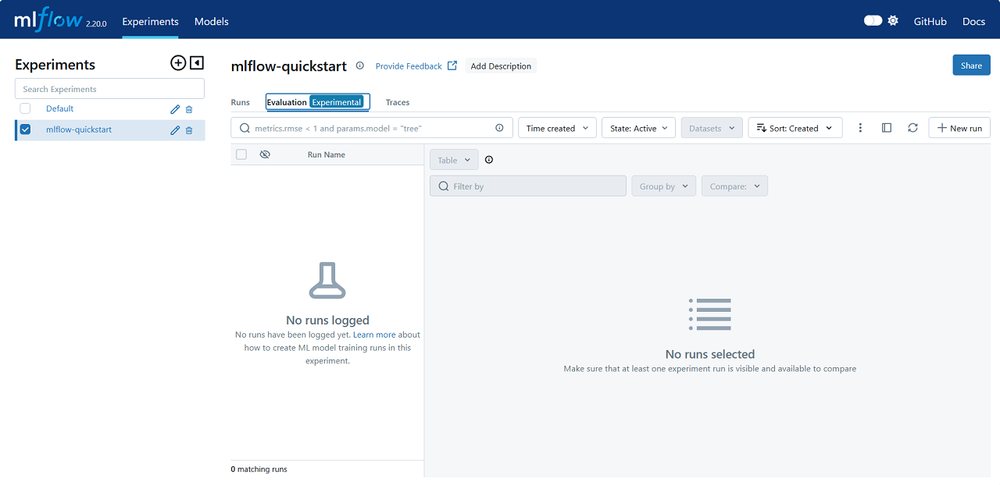

# Jupyter on WSL
## Examples
### Randy Olson's Data Analysis and Machine Learning projects
**Note** This example requires some packages such as *numpy, pandas, scikit-learn, matplotlib, seaborn, watermark*. Please make sure to install these packages using pip or conda if you don't have before you run examples. For more details, checkout the each example notebooks.
```
pip install numpy pandas scikit-learn matplotlib seaborn watermark
```

Move the *data-lab-on-wsl/examples/jupyter* directory and clone the project repository in your terminal. Then, open each notebooks to follow the tutorials for learning data analysis and machine learning.
```
git clone https://github.com/rhiever/Data-Analysis-and-Machine-Learning-Projects.git
```


### MLOps (Machine Learning Operations)
MLOps, or machine learning operations, is a set of practices that help manage the machine learning (ML) lifecycle. It's a combination of machine learning development and system operations. With MLOps, data scientist and data engineers can 1/ automate the process of building, deploying, and maintaining ML models, 2/ ensure that ML models are reliable, efficient, and deliver value, 3/ help organizations implement ML models into production. Therefore, the MLOps solutions provide experiment tracking, data preparation, feature engineering, model training, model deployment, model monitoring, evaluation, model retraining, and governance. Both Kubeflow and MLflow are popular open-source tools used in the field of MLOps, but they serve slightly different purposes and have different strengths. Here is a brief comparison:

- **Kubeflow** is a cloud-native framework designed to simplify the adoption of ML in containerized environments on Kubernetes.
  - Key features:
    - Pipelines: Enables orchestration of complex ML workflows.
    - KServe: Tool for deploying and serving ML models in a serverless manner.
    - Training Operators: Specific operators for managing and scaling training jobs.
    - Notebooks: Integrated development environments for interactive Jupyter notebooks.
  - Use cases: Ideal for organizations that need to deploy ML models at scale and already use Kubernetes.

- **MLflow** is a platform for managing the entire ML lifecycle, including experiment tracking, packaging code into reproducible runs, and managing model deployment.
  - Key features:
    - MLflow Tracking: API and UI for logging parameters, metrics, artifacts, and code versions.
    - Projects: Standard format for packaging reusable code.
    - Models: Standard format for packaging ML models.
    - Model Registry: Centralized model store for managing model lifecycle.
  - Use cases: Great for data scientists who need to track and compare models across different environments.

In summary, *Kubeflow* is more focused on orchestration and deployment of ML workflows in Kubernetes environments, while *MLflow* is centered around experiment tracking and model management. The choice between them depends on your specific needs and infrastructure.

With MLflow example, you can learn how to enable MLflow service and integrate with Jupyter notebook for machine learning lifecycle management. Open the `ml-ops-mlflow` notebook under the *data-lab-on-wsl/examples/jupyter/ml-ops* directory and follow the instructions.

If you are looking for the latest examples and advanced guide for MLflow, please refer to [the official repository](https://github.com/mlflow/mlflow) of mlflow opensource project. You can clone the mlflow into the *data-lab-on-wsl/examples/jupyter/ml-ops* directory and run examples by following the intructions of the jupyter notebooks under the example directory.
```
git clone https://github.com/mlflow/mlflow.git
```



### Simple LLM (Large Language Model)
Open the `simple-llm-student-guide` notebook under the *data-lab-on-wsl/examples/jupyter/simple-llm* directory and follow the instructions.

# Additional Resources
- [Terraform: Amazon SageMaker](https://github.com/Young-ook/terraform-aws-sagemaker/tree/main/examples/blueprint)
- [Terraform: Data on Amazon EKS](https://github.com/Young-ook/terraform-aws-eks/tree/main/examples/data-ai)
- [Tensorflow Tutorials](https://www.tensorflow.org/tutorials)
- [Kubeflow](https://www.kubeflow.org/)
- [MLflow](https://mlflow.org/)
- [Polyaxon](https://polyaxon.com/)

# References
- [Data Analysis and Machine Learning projects](https://github.com/rhiever/Data-Analysis-and-Machine-Learning-Projects)
