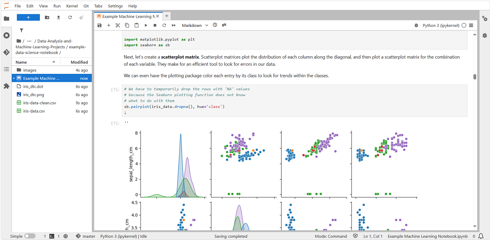

# Jupyter on WSL
## Examples
### Randy Olson's Data Analysis and Machine Learning projects
**Note** This example requires some packages such as *numpy, pandas, scikit-learn, matplotlib, seaborn, watermark*. Please make sure to install these packages using pip or conda if you don't have before you run examples. For more details, checkout the each example notebooks.
```
pip install numpy pandas scikit-learn matplotlib seaborn watermark
```

Move the *data-lab-on-wsl/examples/jupyter* directory and clone the project repository in your terminal. Then, open each notebooks to follow the tutorials for learning data analysis and machine learning.
```
git clone https://github.com/rhiever/Data-Analysis-and-Machine-Learning-Projects.git
```


### Simple LLM (Large Language Model)
Open the *simple-llm/simple-llm-student-guide* notebook and follow the instructions

# References
- [Data Analysis and Machine Learning projects](https://github.com/rhiever/Data-Analysis-and-Machine-Learning-Projects)
- [Building the simplest LLM with Jupyter Notebook: A Students Guide](https://coda.io/@peter-sigurdson/building-the-simplest-llm-with-jupyter-notebook-a-students-guide)

# Additional Resources
- [Terraform: Amazon SageMaker](https://github.com/Young-ook/terraform-aws-sagemaker/tree/main/examples/blueprint)
- [Terraform: Data on Amazon EKS](https://github.com/Young-ook/terraform-aws-eks/tree/main/examples/data-ai)