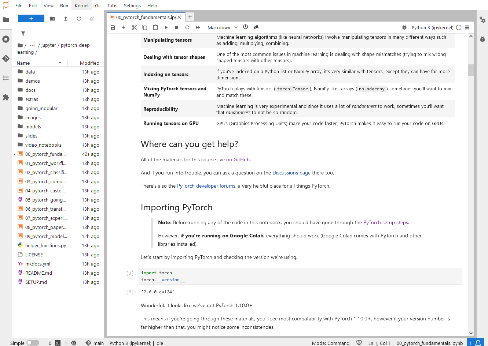
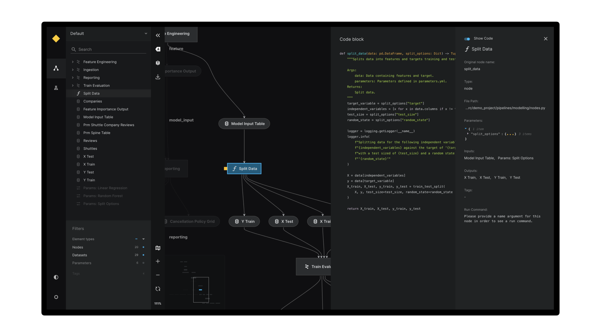

# Jupyter on WSL
## Examples
### PyTorch for Deep Learning Bootcamp
Clone the repository into the *data-lab-on-wsl/examples/jupyter/extra* directory. If you have the *extra* directory you can create before you clone the repository using `mkdir -p extra`. To run hands-on labs, open each notebooks and follow the tutorials for pytorch deep learning course. For more details, please check out the [references](./README.md#references) at the bottom of this page.

**NOTE** Make sure to clone the repository via SSH, not HTTP. Due to the large file size, you might see a gPRC error when you try to download the project over HTTP.
```
git clone git@github.com:mrdbourke/pytorch-deep-learning.git
```

**NOTE** This example requires some packages such as *pytorch*. Please make sure to install these packages using PyPI or conda if you don't have before you run examples. For more details, please refer to the [PyTorch website](https://pytorch.org).
```
pip3 install torch torchvision torchaudio
```



### Randy Olson's Data Analysis and Machine Learning projects
This is a good project for learning data analysis and machine learning with hand-on. To run examples, clone the repository under the *data-lab-on-wsl/examples/jupyter/extra* directory. Please create *extra* directory if you don't have. Open and follow the instructions of each notebooks. For more details, please check out the [references](./README.md#references) at the bottom of this page.

```
git clone https://github.com/rhiever/Data-Analysis-and-Machine-Learning-Projects.git
```

**NOTE** This example requires some packages such as *numpy, pandas, scikit-learn, matplotlib, seaborn, watermark*. Please make sure to install these packages using pip or conda if you don't have before you run examples.
```
pip install numpy pandas scikit-learn matplotlib seaborn watermark
```


### MLflow
MLOps(Machine Learning Operations) is a set of practices that help manage the machine learning (ML) lifecycle. It's a combination of machine learning development and system operations. With MLOps, data scientist and data engineers can 1/ automate the process of building, deploying, and maintaining ML models, 2/ ensure that ML models are reliable, efficient, and deliver value, 3/ help organizations implement ML models into production. Therefore, the MLOps solutions provide experiment tracking, data preparation, feature engineering, model training, model deployment, model monitoring, evaluation, model retraining, and governance. Both Kubeflow and MLflow are popular open-source tools used in the field of MLOps, but they serve slightly different purposes and have different strengths. Here is a brief comparison:

- **Kubeflow** is a cloud-native open-source framework designed to simplify the adoption of ML in containerized environments on Kubernetes.
  - Key features:
    - Pipelines: Enables orchestration of complex ML workflows.
    - KServe: Tool for deploying and serving ML models in a serverless manner.
    - Training Operators: Specific operators for managing and scaling training jobs.
    - Notebooks: Integrated development environments for interactive Jupyter notebooks.
  - Use cases: Ideal for organizations that need to deploy ML models at scale and already use Kubernetes.

- **MLflow** is an open-source platform, purpose-built to assist machine learning practitioners and teams in managing the complexities of the entire ML lifecycle, including experiment tracking, packaging code into reproducible runs, and managing model deployment.
  - Key features:
    - MLflow Tracking: API and UI for logging parameters, metrics, artifacts, and code versions.
    - Projects: Standard format for packaging reusable code.
    - Models: Standard format for packaging ML models.
    - Model Registry: Centralized model store for managing model lifecycle.
  - Use cases: Great for data scientists who need to track and compare models across different environments.

In summary, *Kubeflow* is more focused on orchestration and deployment of ML workflows in Kubernetes environments, while *MLflow* is centered around experiment tracking and model management. The choice between them depends on your specific needs and infrastructure.

> [!TIP]
> This example is based on *MLflow*, which is relatively simple to implement. For a *Kubeflow* example that requires Kubernetes to be installed, see the [Terraform: Data on Amazon EKS](https://github.com/Young-ook/terraform-aws-eks/tree/main/examples/data-ai) repository.

#### Install MLflow
**[Don't Forget]** to make sure that you've activated the python virtual environment with `source .venv/bin/activate` in the *data-lab-on-wsl* local directory.

You might have installed MLflow when you tried to install the Jupyter using `requirements.txt`, but if not, install MLflow from PyPI(Python Package Index). Open a terminal and activate the same virtual environment where we are running Jupyter, and install MLflow package: `pip install mlflow==2.20.0`. The version we will use in this example is 2.20.0. If you want to install the latest version of MLflow, just run command without specific version: `pip install mlflow`.

#### Running ML experiments with MLflow Tracking Server
MLflow Tracking Server is a centralized HTTP server that allows you to access your experiments artifacts regardless of where you run your code. To use the Tracking Server, you can either run it locally or use a managed service. Additionally, MLflow is a vendor-neutral, open-source platform which means you have access to the MLflow’s core capabilities sets such as tracking, evaluation, observability, and more, regardless of where you are doing machine learning.

**NOTE** This local tracking server is simple and easy to use for testing or practice, but we recommend running a remote MLflow tracking server for use in production. Please refer to the [MLflow Tracking Server guide](https://mlflow.org/docs/latest/tracking/server.html) for more infromation about how to enable persistent backend or add upsteam proxy, or change other configurations.

To start the local tracking server, move to the *data-lab-on-wsl/examples/jupyter/ml-ops* in a terminal with the virtual environment activated and run the `mlflow server` CLI command. By default, the tracking server will be running at `http://localhost:5000` and you can change the host name and port number using parameters: `mlflow server --host 127.0.0.1 --port 5000`. We'll use the MLflow fluent API to perform all interactions with the tracking server.

Now you can start to learn how to integrate MLflow and Jupyter notebook for MLOps. Open the `mlflow.ipynb` notebook under the *data-lab-on-wsl/examples/jupyter/ml-ops* directory and follow the instructions. After you finished the lab, you will see `mlartifacts` and `mlruns` directories createdy by MLflow Tracking Server.

#### Addtional MLflow Examples
If you are looking for the latest examples and advanced guide for MLflow, you can follow the instructions from [the official MLflow repository](https://github.com/mlflow/mlflow). Clone the mlflow into the *data-lab-on-wsl/examples/jupyter/extra* directory and run examples by following the intructions of each jupyter notebooks under the example directory. You should make a *extra* directory where to clone the mlflow examples if you don't have it on your workspace.
```
git clone https://github.com/mlflow/mlflow.git
```


#### Running ML pipelines with MLflow and Airflow
- [MLOps with MLflow and Airflow](../airflow/README.md#mlops-with-mlflow-and-airflow)

#### Running ML pipelines with Kedro
Kedro is an open-source Python framework to create reproducible, maintainable, and modular data science code. It uses software engineering best practices to help you build production-ready data science pipelines.

You can build MLOps pipeline by following the official [Kedro Tutorial](https://docs.kedro.org/en/stable/tutorial/spaceflights_tutorial.html). And this is Kedro-Viz example.



### Simple LLM (Large Language Model)
Open the `simple-llm-student-guide` notebook under the *data-lab-on-wsl/examples/jupyter/simple-llm* directory and follow the instructions.

# Additional Resources
- [Terraform: Amazon SageMaker](https://github.com/Young-ook/terraform-aws-sagemaker/tree/main/examples/blueprint)
- [Terraform: Data on Amazon EKS](https://github.com/Young-ook/terraform-aws-eks/tree/main/examples/data-ai)
- [Linux Foundation AI/Data Projects](https://lfaidata.foundation/projects/)
- [PyTorch Tutorials](https://pytorch.org/tutorials/)
- [Tensorflow Tutorials](https://www.tensorflow.org/tutorials)
- [Kubeflow](https://www.kubeflow.org/)
- [MLflow](https://mlflow.org/)
- [Polyaxon](https://polyaxon.com/)
- [ZenML](https://www.zenml.io/)

# References
- [PyTorch for Deep Learning Bootcamp](https://github.com/mrdbourke/pytorch-deep-learning).
- [Data Analysis and Machine Learning Projects](https://github.com/rhiever/Data-Analysis-and-Machine-Learning-Projects)
