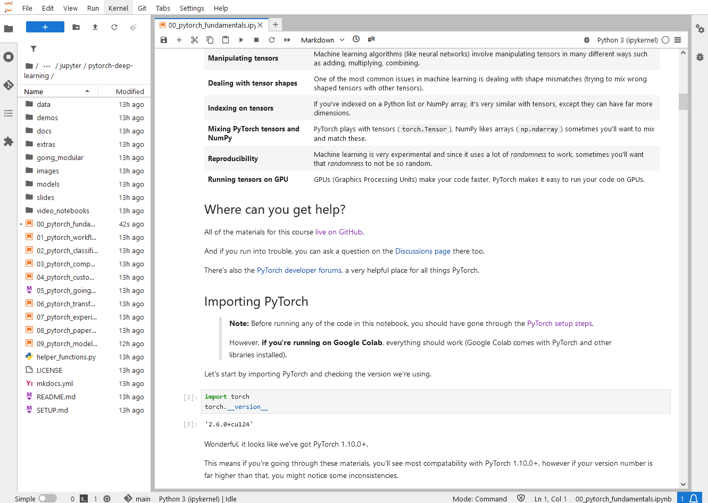
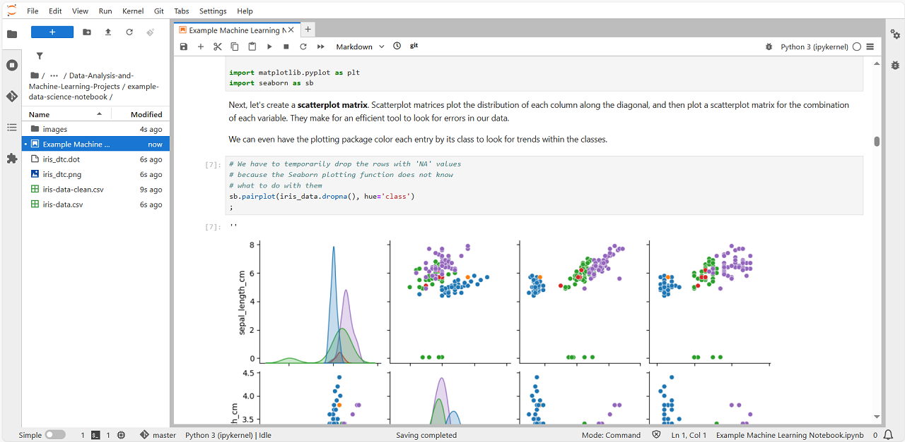

# Jupyter
Jupyter is the web-based interactive development environment for notebooks, code, and data. Its flexible interface allows users to configure and arrange workflows in data science, scientific computing, computational journalism, and machine learning. A modular design invites extensions to expand and enrich functionality.


## Notebooks
- `dataset.ipynb`
- `feature-engineering.ipynb`
- `simple-llm-student-guide.ipynb`

## Other Examples
### PyTorch for Deep Learning Bootcamp
Clone the repository into the *data-lab/labs/extra* directory (if you have the *extra* directory you can create before you clone the repository using `mkdir -p extra`). To run hands-on labs, open each notebooks and follow the tutorials for pytorch deep learning course. For more details, please check out the [PyTorch for Deep Learning Bootcamp](https://github.com/mrdbourke/pytorch-deep-learning).

> [!NOTE]
> Make sure to clone the repository via SSH, not HTTP. Due to the large file size, you might see a gRPC error when you try to download the project over HTTP.
> ```
> git clone git@github.com:mrdbourke/pytorch-deep-learning.git
> ```

> [!NOTE]
> This example requires some packages such as *pytorch*. Please make sure to install these packages using PyPI or conda if you don't have before you run examples. For more details, please refer to the [PyTorch website](https://pytorch.org).
> ```
> pip3 install torch torchvision torchaudio
> ```



### Randy Olson's Data Analysis and Machine Learning projects
This is a good project for learning data analysis and machine learning with hand-on. To run examples, clone the repository under the *data-lab/labs/extra* directory. Open and follow the instructions of each notebooks. For more details, please check out the [Data Analysis and Machine Learning Projects](https://github.com/rhiever/Data-Analysis-and-Machine-Learning-Projects).

```
git clone https://github.com/rhiever/Data-Analysis-and-Machine-Learning-Projects.git
```

> [!NOTE]
> This example requires some packages such as *numpy, pandas, scikit-learn, matplotlib, seaborn, watermark*. Please make sure to install these packages using pip or conda if you don't have before you run examples.
> ```
> pip install numpy pandas scikit-learn matplotlib seaborn watermark
> ```



# References
- [Jupyter](https://jupyter.org/)

# Additional Resources
- [PyTorch Tutorials](https://pytorch.org/tutorials/)
- [Tensorflow Tutorials](https://www.tensorflow.org/tutorials)

