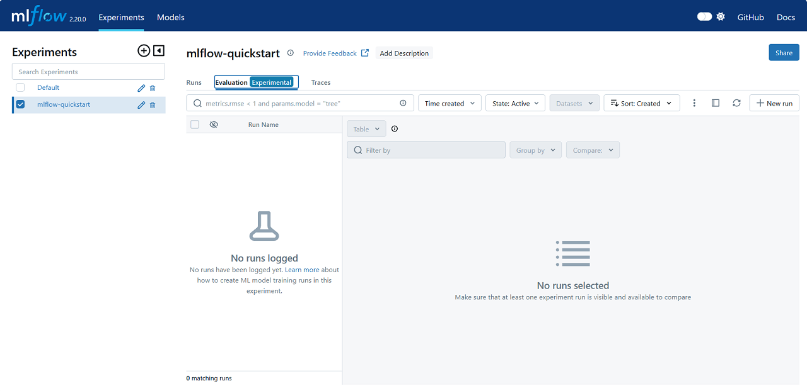

# MLflow
MLflow is an open-source developer platform to build and enhance AI/ML applications with confidence by providing end-to-end experiment tracking, observability, and evaluations, all in one integrated platform.

## MLOps (Machine Learning Operations)

Stepping into the world of ML is an exciting journey, but it often comes with complexities that can hinder innovation and experimentation. A workflow solutions to solve many of these issues, offering tools and simplifying processes to streamline the ML lifecycle and foster collaboration.

MLOps is a paradigm that aims to deploy and maintain machine learning models in production reliably and efficiently and a set of practices that help manage the machine learning lifecycle. It bridges the gap between machine learning development and production operations, ensuring that models are robust, scalable, and aligned with business goals.

The word is a compound of "machine learning" and the continuous delivery practice (CI/CD) of DevOps in the software field. Machine learning models are tested and developed in isolated experimental systems. When an algorithm is ready to be launched, MLOps is practiced between Data Scientists, DevOps, and Machine Learning engineers to transition the algorithm to production systems.[1] Similar to DevOps or DataOps approaches, MLOps seeks to increase automation and improve the quality of production models, while also focusing on business and regulatory requirements. While MLOps started as a set of best practices, it is slowly evolving into an independent approach to ML lifecycle management. MLOps applies to the entire lifecycle - from integrating with model generation (software development lifecycle, continuous integration/continuous delivery), orchestration, and deployment, to health, diagnostics, governance, and business metrics.

Both Kubeflow and MLflow are popular open-source tools used in the field of MLOps, but they serve slightly different purposes and have different strengths. Here is a brief comparison:

- **Kubeflow** is a cloud-native open-source framework designed to simplify the adoption of ML in containerized environments on Kubernetes.
  - Key features:
    - Pipelines: Enables orchestration of complex ML workflows.
    - KServe: Tool for deploying and serving ML models in a serverless manner.
    - Training Operators: Specific operators for managing and scaling training jobs.
    - Notebooks: Integrated development environments for interactive Jupyter notebooks.
  - Use cases: Ideal for organizations that need to deploy ML models at scale and already use Kubernetes.

- **MLflow** is an open-source platform, purpose-built to assist machine learning practitioners and teams in managing the complexities of the entire ML lifecycle, including experiment tracking, packaging code into reproducible runs, and managing model deployment.
  - Key features:
    - MLflow Tracking: API and UI for logging parameters, metrics, artifacts, and code versions.
    - Projects: Standard format for packaging reusable code.
    - Models: Standard format for packaging ML models.
    - Model Registry: Centralized model store for managing model lifecycle.
  - Use cases: Great for data scientists who need to track and compare models across different environments.

In summary, *Kubeflow* is more focused on orchestration and deployment of ML workflows in Kubernetes environments, while *MLflow* is centered around experiment tracking and model management. The choice between them depends on your specific needs and infrastructure.

> [!NOTE]
> This example is based on *MLflow*, which is relatively simple to implement. For a *Kubeflow* example that requires Kubernetes to be installed, see the [Terraform: Data on Amazon EKS](https://github.com/Young-ook/terraform-aws-eks/tree/main/examples/data-ai) repository.

## Notebooks
- `mlflow.ipynb`

## Alternatives

### Apache Airflow
Apache Airflow is an open-source workflow management platform for data engineering and MLOps pipelines. To learn more details of machine learning lifecycle management with Airflow, follow the instructions in the [airflow.md](../airflow/airflow.md).

### Kedro
Kedro is an open-source Python framework to create reproducible, maintainable, and modular data science code. It uses software engineering best practices to help you build production-ready data science pipelines. You can build your MLOps pipeline by following the official [Kedro Tutorial](https://docs.kedro.org/en/stable/tutorial/spaceflights_tutorial.html).

### ZenML
ZenML is an open-source MLOps framework that seamlessly integrates existing infrastructure and tools. You can launch and test a ZenML yourself and take a tour with the guided [Quick Start](https://github.com/zenml-io/zenml/tree/main/examples/quickstart). And if you want to learn more details of ZenML for ML lifecycle management, you can look into the [ZenML](https://github.com/zenml-io/zenml) guide.

# Additional Resources
- [Airflow](https://airflow.apache.org/)
- [Kubeflow](https://www.kubeflow.org/)
- [MLflow](https://mlflow.org/)
- [Polyaxon](https://polyaxon.com/)
- [ZenML](https://www.zenml.io/)

