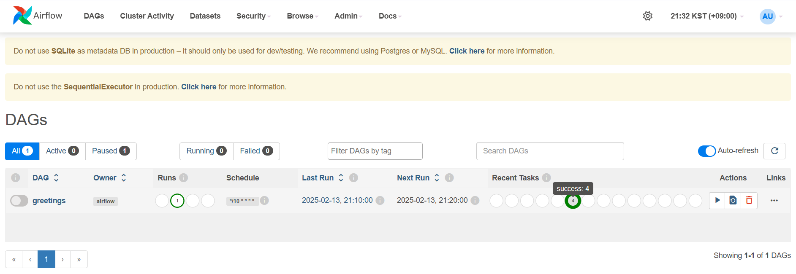

# Machine Learning (ML) Workflows

## Apache Airflow
### Install Airflow
You might have installed Airflow when you tried to install the Jupyter using `requirements.txt`, but if not, follow the *(Optional) Set Airlfow home directory* and *Install Airflow using the constraints file, which is determined based on the URL we pass* steps to install Airflow from PyPI(Python Package Index).

> [!WARNING]
> **DON'T FORGET** to make sure that you've activated the python virtual environment with `source .venv/bin/activate` in the *data-lab* local directory.

#### (Optional) Set Airlfow home directory
The first time you run Airflow, it will create a file called `airflow.cfg` in your `AIRFLOW_HOME` directory (`$HOME/airflow` by default). The `AIRFLOW_HOME` environment variable is used to inform Airflow of the desired location. This step of setting the environment variable should be done before installing Airflow so that the installation process knows where to store the necessary files.

You can set the home directory to a similar path commonly used by other tools: `export AIRFLOW_HOME=$HOME/.airflow`
. Or, if you want one easy way to manage things, you can put everything in one place. Go to the *data-lab/examples/jupyter/ml-ops* and configure the environment variable: `export AIRFLOW_HOME=$PWD/airflow`.

In this example, we will use the default home directory, skip for now.

#### Install Airflow using the constraints file, which is determined based on the URL we pass
Run the below where the same virtual environment Jupyter is running Jupyter. In this example we will install version 2.10.4, but if you always want to install the latest version, just remove the version from the pip install command (`pip install apache-airflow`).
```bash
AIRFLOW_VERSION=2.10.4

# Extract the version of Python you have installed. If you're currently using a Python version that is not supported by Airflow, you may want to set this manually.
# See above for supported versions.
PYTHON_VERSION="$(python -c 'import sys; print(f"{sys.version_info.major}.{sys.version_info.minor}")')"

#CONSTRAINT_URL="https://raw.githubusercontent.com/apache/airflow/constraints-${AIRFLOW_VERSION}/constraints-${PYTHON_VERSION}.txt"
# For example this would install 2.10.4 with python 3.8: https://raw.githubusercontent.com/apache/airflow/constraints-2.10.4/constraints-3.8.txt

pip install "apache-airflow==${AIRFLOW_VERSION}" #--constraint "${CONSTRAINT_URL}"
```

### Run Airflow Standalone
Run `airflow standalone` command to initialize the database, creates a user, and starts all components at once. The PID file for the webserver will be stored in `$AIRFLOW_HOME/airflow-webserver.pid` or in `/run/airflow/webserver.pid` if started by systemd.

> [!NOTE]
> This local system is simple and easy to use for testing or practice, but we recommend enable security, governance, monitoring, reverse proxing, persistent backend and more for use in production.

If you want to run the individual parts of Airflow manually rather than using the all-in-one standalone command, you can instead run:
```bash
airflow db migrate

airflow users create --username admin --firstname FIRST_NAME --lastname LAST_NAME --role Admin --email admin@example.org
Password:

airflow webserver --port 8080
airflow scheduler
```

## MLOps with MLflow and Airflow
MLflow excels at managing the machine learning lifecycle, including experiment tracking, model management, and serving. However, it doesn't provide powerful features for workflow management and automation and ideal capabilities for orchestrating complex data pipelines. Apache Airflow, on the other hand, is an open-source platform for developing, scheduling, and monitoring batch-oriented workflows. Airflow’s extensible Python framework enables you to build workflows connecting with virtually any technology. A web interface helps manage the state of your workflows. MLflow and Airflow are two pivotal tools in the MLOps ecosystem, each serving distinct purposes that complement one another when integrated. In this example, we will learn how to integrate Airflow and MLflow for automatic ML lifecycle management.

### Access Airflow
Press `ctrl+c` to stop the Airflow. And Open the Airflow configuration file `$HOME/airflow/airflow.cfg` (or if you customized your Airflow home directory, open the `$AIRFLOW_HOME/airflow.cfg`) to turn off default example loading: `load_examples = False`.

Alos, you can override default configurations using environment variables, see [Configuration Reference](https://airflow.apache.org/docs/apache-airflow/stable/configurations-ref.html). You can inspect the file either in `$AIRFLOW_HOME/airflow.cfg`, or through the UI in the `Admin > Configuration` menu.

Restart Airflow standalone: `airflow standalone`. Visit `localhost:8080` in your browser and log in with the admin account details (user name and automatically generated password) shown in the terminal.

Once logged in, go to the *Cluster Activity*, and verify your Airflow standalone cluster is healty.


You may see an error message on the *Cluster Activity*. This could be due to insufficient available memory. Please make sure your system has enough free memory (recommended minimum memory is 4GB) and restart your Airflow standalone cluster.
```
The scheduler does not appear to be running. Last heartbeat was received a few seconds ago.
The DAGs list may not update, and new tasks will not be scheduled.
```

### Workflow Management with DAG(Directed Acyclic Graph)
A [DAG](https://airflow.apache.org/docs/apache-airflow/stable/core-concepts/dags.html) is the core concept of Airflow, collecting Tasks together, organized with dependencies and relationships to say how they should run. This DAG file repository is configured as `dags_folder` variable in the `airflow.cfg` file and the default path is `~/airflow/dags` (same as `$HOME/airflow/dags`). Copy the dags directory from the cloned repository into the Airflow home direcotry.
```
cp -r labs/mlops/dags $HOME/airflow/
```

You will see the `greetings` and `ml_train` in the *DAGs* when you back to the Airflow. With these DAGs, you can see how Airflow works and how to integrate Airflow and MLflow for ML workflow management. Go to the *DAGs* and run what you want.



> [!IMPORTANT]
> Please make sure that your MLflow Tracking Server is running before you run the MLOps with Airflow and MLflow DAG. For more information how to run a MLflow Tracking Server, follow the [Install MLflow](../jupyter/README.md#install-mlflow) instructions.

If the ML pipeline was successfully finished, you can see the a new experiment has been recorded in MLflow Tracking Server. Access `localhost:5000` to see the latest experiment *airflow* registred as the source.


# Additional Resources

# References
- [Installation of Airflow](https://airflow.apache.org/docs/apache-airflow/stable/installation/index.html)
- [Airflow Production Deployment](https://airflow.apache.org/docs/apache-airflow/stable/administration-and-deployment/production-deployment.html)
